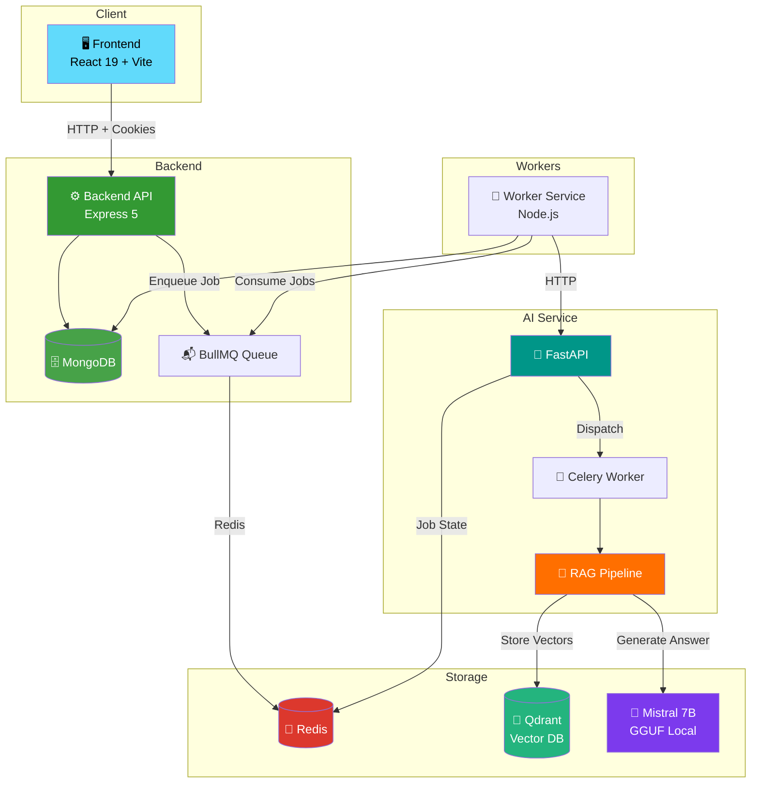
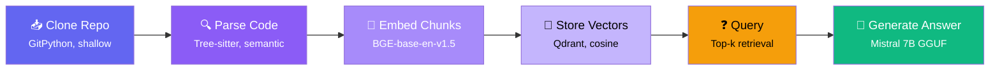

<p align="center">
  <h1 align="center">🧠 CodeSage</h1>
  <p align="center">
    <strong>AI-Powered Source Code Analysis Platform</strong>
  </p>
  <p align="center">
    Submit a GitHub repo → Get intelligent code insights powered by RAG + Local LLM
  </p>
</p>

<p align="center">
  
  
  
  
  
  
</p>

---

## What is CodeSage?

CodeSage is a **distributed microservices platform** that analyzes source code repositories using a RAG (Retrieval-Augmented Generation) pipeline. It clones repositories, parses code into semantic chunks using Tree-sitter, generates vector embeddings, stores them in Qdrant, and answers natural language questions about the codebase using a locally-running Mistral 7B LLM.

**Key highlights:**
- 🔒 **Zero API costs** — runs Mistral 7B locally via GGUF, no OpenAI keys needed
- 🧩 **Semantic code parsing** — Tree-sitter extracts functions, classes, not just text blocks
- ⚡ **Async job pipeline** — BullMQ + Celery for non-blocking analysis
- 🔍 **RAG with sources** — every answer includes file paths, line numbers, and similarity scores
- 🔐 **Production auth** — JWT dual-token with httpOnly cookies, refresh rotation
- 📊 **Observability** — correlation IDs traced across all 4 services

---

## Architecture



### Services at a Glance

| Service | Stack | Port | Responsibility |
|---------|-------|------|---------------|
| **Frontend** | React 19, Vite 8, React Router 7, Axios | `5173` | User interface — auth, repo management, analysis viewer |
| **Backend API** | Express 5, Mongoose 9, BullMQ, JWT | `5000` | REST API — authentication, CRUD, job orchestration |
| **AI Service** | FastAPI, Celery, sentence-transformers, Qdrant | `8000` | RAG pipeline — code parsing, embedding, vector search, LLM |
| **Workers** | Node.js, BullMQ Worker, Axios | — | Async job consumer — bridges backend to AI service |

---

## RAG Pipeline

The core intelligence of CodeSage — how it turns raw code into searchable knowledge:



| Stage | Technology | Details |
|-------|-----------|---------|
| **Clone** | GitPython | Shallow clone (`depth=1`), token auth for private repos, 100MB size limit, timeout enforcement |
| **Parse** | Tree-sitter + regex chunker | Semantic extraction of functions/classes, 60-line windows with 12-line overlap, supports `.py`, `.js`, `.ts`, `.go`, `.java` |
| **Embed** | `BAAI/bge-base-en-v1.5` | 768-dimensional vectors, batch encoding, L2-normalized, code-specific prefix prompts |
| **Store** | Qdrant | Cosine similarity, collection-per-repo, UUID5 point IDs, rich payload (file path, line numbers, symbol name) |
| **Query** | Vector search + LLM | Top-k retrieval → context assembly → Mistral 7B generates answer with file citations |

---

## API Reference

### Backend API (`localhost:5000`)

<details>
<summary><strong>🔐 Authentication</strong></summary>

| Method | Endpoint | Auth | Description |
|--------|----------|------|-------------|
| `POST` | `/api/auth/register` | — | Register with username, email, password |
| `POST` | `/api/auth/login` | — | Login → sets httpOnly JWT cookies |
| `POST` | `/api/auth/refresh` | — | Rotate access + refresh tokens |
| `POST` | `/api/auth/logout` | JWT | Clear cookies, invalidate refresh token |

</details>

<details>
<summary><strong>📁 Repositories</strong></summary>

| Method | Endpoint | Auth | Description |
|--------|----------|------|-------------|
| `POST` | `/api/repos/create` | JWT | Add a repository (URL, provider, visibility) |
| `GET` | `/api/repos` | JWT | List user's repositories |
| `GET` | `/api/repos/:repoId` | JWT | Get single repository details |
| `DELETE` | `/api/repos/:repoId` | JWT | Delete repository (ownership check) |
| `POST` | `/api/repos/:repoId/rerun` | JWT | Re-run analysis (placeholder) |

</details>

<details>
<summary><strong>📊 Jobs</strong></summary>

| Method | Endpoint | Auth | Description |
|--------|----------|------|-------------|
| `POST` | `/api/jobs/analyze` | JWT | Enqueue analysis job (idempotency supported) |
| `GET` | `/api/jobs/:jobId` | JWT | Get job status + details |

</details>

### AI Service API (`localhost:8000`)

| Method | Endpoint | Auth | Description |
|--------|----------|------|-------------|
| `GET` | `/health` | — | Health check (Redis, Qdrant, LLM model status) |
| `POST` | `/v1/index` | `X-API-Key` | Submit repo for indexing → Celery background task |
| `GET` | `/v1/index/{job_id}/status` | — | Poll indexing progress (stage + percentage) |
| `DELETE` | `/v1/index/{job_id}` | `X-API-Key` | Cancel an indexing job |
| `POST` | `/v1/query` | `X-API-Key` | Ask a question about indexed code (RAG) |

---

## Project Structure

```
codeSage/
├── frontend/                          # React + Vite SPA
│   └── src/
│       ├── api/                       # auth.api.js, repos.api.js
│       ├── components/                # Navbar, Layout, ProtectedRoute
│       ├── context/                   # AuthContext (user state, axios, theme)
│       ├── hooks/                     # useAuth (login/register/logout)
│       ├── pages/                     # Dashboard, Login, Register, Analysis, etc.
│       ├── App.jsx                    # Root with AuthProvider + Router
│       └── app.routes.jsx             # Route definitions
│
├── backend/                           # Express API server
│   └── src/
│       ├── controllers/               # auth, repo, job controllers
│       ├── models/                    # User, Repo, Job Mongoose schemas
│       ├── middlewares/               # JWT auth, correlation IDs, validation
│       ├── routes/                    # Route registrations
│       ├── queue/                     # BullMQ queue + Redis connection
│       └── app.js                     # Express app configuration
│
├── ai-service/                        # FastAPI AI microservice
│   └── app/
│       ├── api/                       # health, indexing, query endpoints
│       ├── core/                      # config, logger, redis utils, security
│       ├── llm/                       # LLM generator + client (Mistral 7B)
│       ├── rag/
│       │   ├── parser/                # repo_loader, tree_sitter, chunker
│       │   ├── embeddings/            # encoder, embedder, vector_store, qdrant
│       │   └── pipeline/              # End-to-end RAG orchestrator
│       ├── tasks/                     # Celery background indexing task
│       └── main.py                    # FastAPI entry point
│
├── workers/                           # BullMQ job consumer
│   └── src/
│       ├── jobs/                      # analyze.job.js (job handler)
│       ├── processors/                # analysis.processor.js
│       ├── services/                  # aiClient.js (HTTP to AI service)
│       └── utils/                     # Structured logger
│
├── docs/
│   └── ARCHITECTURE.md                # Detailed file-by-file documentation
└── README.md
```

> 📖 **For detailed file-by-file documentation**, see **[docs/ARCHITECTURE.md](docs/ARCHITECTURE.md)**

---

## Quick Start

### Prerequisites

- **Node.js** ≥ 18, **Python** ≥ 3.10, **Docker**
- **MongoDB** (local or [Atlas](https://cloud.mongodb.com/))

### 1. Infrastructure (Redis + Qdrant)

```bash
cd ai-service
docker-compose up redis qdrant -d
```

### 2. Backend API

```bash
cd backend
cp .env_example .env   # Set MONGO_URI, REDIS_URL, JWT_SECRET
npm install && node server.js
```

### 3. AI Service + Celery Worker

```bash
cd ai-service
python -m venv venv && .\venv\Scripts\activate  # Windows
pip install -r requirements.txt
uvicorn app.main:app --port 8000 --reload

# In a separate terminal:
celery -A app.celery_app.celery_app worker -l info --pool=solo
```

### 4. Frontend

```bash
cd frontend
npm install && npm run dev
```

### 5. Worker Service

```bash
cd workers
node worker.js
```

---

## Environment Variables

<details>
<summary><strong>Backend</strong> <code>.env</code></summary>

```env
PORT=5000
MONGO_URI=mongodb://localhost:27017/codesage
REDIS_URL=redis://localhost:6379
JWT_SECRET=your-secret-key
```
</details>

<details>
<summary><strong>AI Service</strong> <code>.env</code></summary>

```env
SECRET_KEY=your-api-key-here
REDIS_URL=redis://localhost:6379/0
QDRANT_URL=http://localhost:6333
EMBEDDING_MODEL=BAAI/bge-base-en-v1.5
LLM_MODEL_PATH=./models/mistral-7b-instruct-v0.3.Q4_K_M.gguf
LLM_N_CTX=4096
LLM_N_GPU_LAYERS=0
ALLOWED_ORIGINS=http://localhost:5173,http://localhost:3000
```
</details>

<details>
<summary><strong>Workers</strong> <code>.env</code></summary>

```env
MONGO_URI=mongodb://localhost:27017/codesage
REDIS_URL=redis://localhost:6379
AI_SERVICE_URL=http://localhost:8000
```
</details>

---

## Testing the AI Service

Verified working flow in Postman:

```bash
# 1. Health check
GET http://localhost:8000/health

# 2. Index a repository
POST http://localhost:8000/v1/index
Headers: X-API-Key: <SECRET_KEY>, Content-Type: application/json
Body: {"repo_url": "https://github.com/pallets/markupsafe", "repo_id": "markupsafe-test"}

# 3. Poll status (use job_id from step 2)
GET http://localhost:8000/v1/index/{job_id}/status
# Stages: queued → cloning → parsing → encoding → upserting → completed

# 4. Query the code (requires GGUF model)
POST http://localhost:8000/v1/query
Headers: X-API-Key: <SECRET_KEY>, Content-Type: application/json
Body: {"repo_id": "markupsafe-test", "question": "How does the escape function work?", "top_k": 5}
```

---

## Design Decisions

| Decision | Why |
|----------|-----|
| **Dual JWT (access + refresh)** | 15-min access token limits exposure; 7-day refresh enables smooth UX with rotation |
| **httpOnly cookies** | Immune to XSS token theft unlike localStorage |
| **Idempotency keys on jobs** | Prevents duplicate submissions from network retries |
| **Correlation IDs everywhere** | One UUID traces a request across Frontend → Backend → Queue → Worker → AI Service |
| **Local GGUF LLM** | Zero API costs, full data privacy, works offline |
| **Qdrant over ChromaDB** | Native async support, production-grade, better scaling |
| **Celery for heavy tasks** | Keeps FastAPI event loop free; indexing can take minutes |
| **Semantic chunking** | Tree-sitter function/class extraction produces better retrieval than naive splitting |
| **BullMQ** | Battle-tested Redis queue with retry, backoff, dead-letter, priority support |

---

## Implementation Status

### ✅ Complete

- JWT auth system with token rotation and httpOnly cookies
- User, Repository, Job data models with Mongoose
- Repository CRUD with ownership validation
- BullMQ async job queue with idempotency support
- Correlation ID middleware for distributed tracing
- Worker service with job lifecycle management
- FastAPI AI service with health, indexing, query endpoints
- Full RAG pipeline: clone → parse → embed → store → query
- Tree-sitter semantic parser + adaptive regex chunker
- BGE-base-en-v1.5 embedding encoder (768-dim)
- Qdrant vector store with async/sync dual interface
- Celery background indexing with progress tracking
- Local Mistral 7B GGUF inference
- API key auth + rate limiting on AI service
- Frontend: Dashboard, Login, Register, Analysis, About pages
- Docker Compose for infrastructure

### 🔲 Remaining

- [ ] Wire up frontend login/register form submissions
- [ ] Connect Dashboard "Add repo" button to API
- [ ] Replace Analysis page mockup with real data
- [ ] SSE streaming endpoint for live analysis output
- [ ] `useStreaming` React hook + StreamingOutput component
- [ ] AnalysisResult Mongoose model for persistent results
- [ ] Global Express error handling middleware
- [ ] Root docker-compose for full-stack deployment
- [ ] Comprehensive test suite
- [ ] CI/CD pipeline

---

## Tech Stack

| Layer | Technology |
|-------|-----------|
| **Frontend** | React 19, Vite 8, React Router 7, Axios |
| **Backend** | Node.js, Express 5, Mongoose 9, BullMQ |
| **AI Service** | Python 3.13, FastAPI, Celery |
| **Embeddings** | BAAI/bge-base-en-v1.5 (768-dim) |
| **LLM** | Mistral 7B Instruct (GGUF Q4_K_M, llama-cpp-python) |
| **Vector DB** | Qdrant |
| **Database** | MongoDB |
| **Queue** | BullMQ + Redis |
| **Auth** | JWT (dual token), bcrypt, httpOnly cookies |
| **Infra** | Docker, Docker Compose |

---

## License

ISC

---

<p align="center">
  Built by <a href="https://github.com/AkshatVerma087">Akshat Verma</a>
</p>
