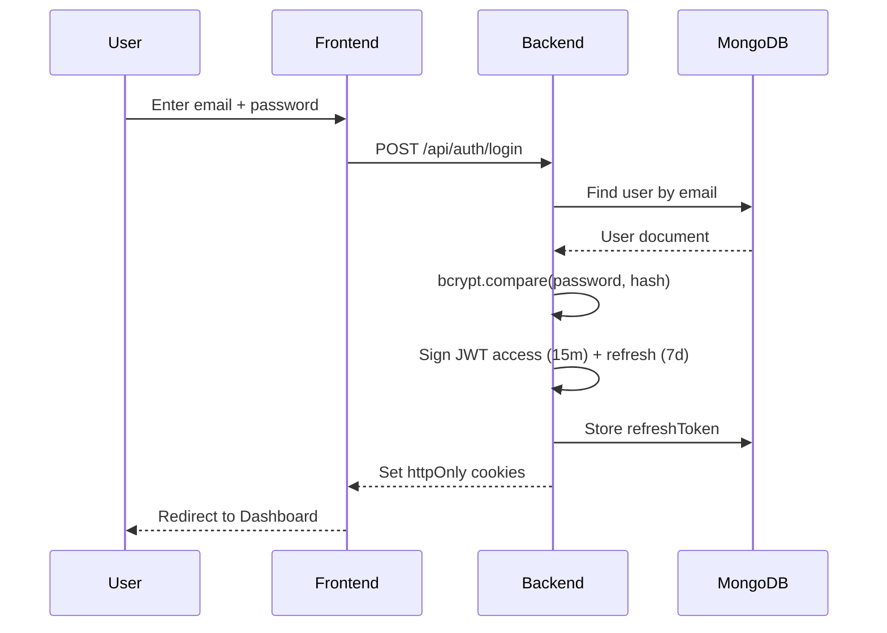
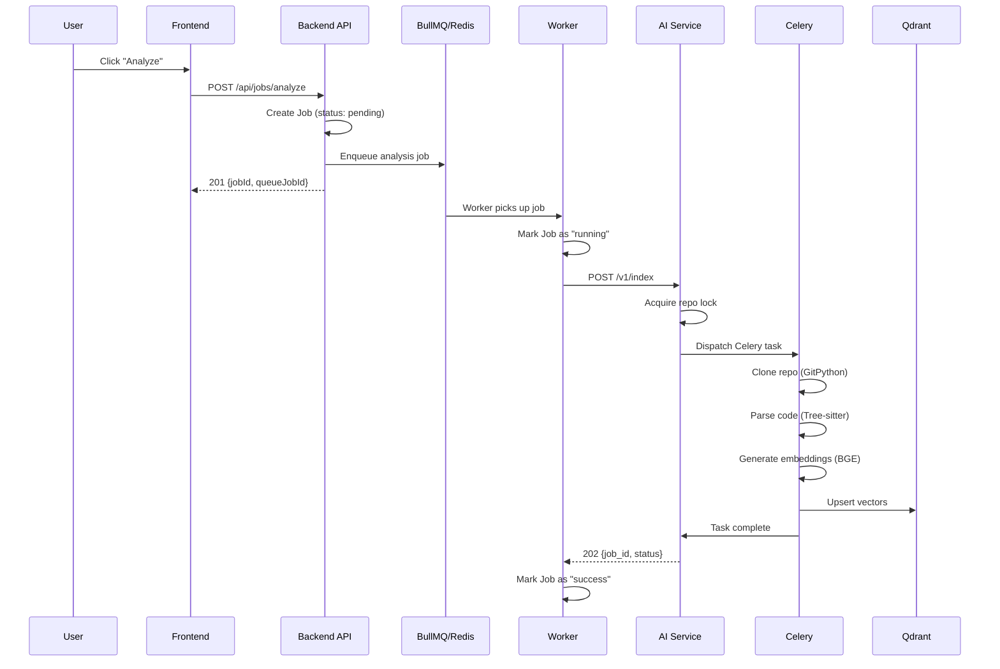
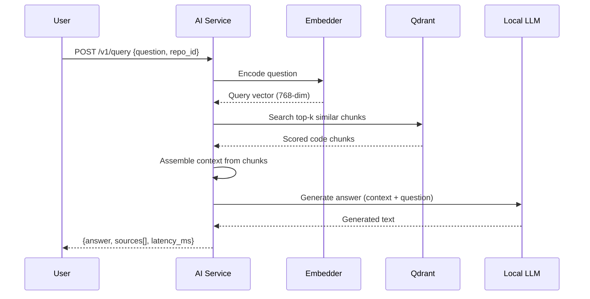
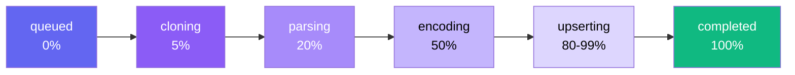

# CodeSage — Detailed Architecture & File Reference

> Complete file-by-file documentation for every service in the CodeSage platform.

---

## Table of Contents

- [Backend API Service](#backend-api-service)
- [Frontend Application](#frontend-application)
- [AI Service](#ai-service)
- [Worker Service](#worker-service)

---

## Backend API Service

**Path:** `backend/` · **Stack:** Node.js, Express 5, Mongoose 9, BullMQ, JWT

### Entry Points

| File | Description |
|------|-------------|
| `server.js` | Loads environment, connects to MongoDB via Mongoose, starts Express on `PORT` (default 5000) |
| `src/app.js` | Express app configuration — CORS, JSON body parsing, cookie-parser, correlation ID middleware, mounts all route groups under `/api/auth`, `/api/repos`, `/api/jobs` |

### Models (`src/models/`)

| File | Schema | Key Fields |
|------|--------|------------|
| `auth.model.js` | **User** | `username`, `email`, `password` (bcrypt hashed), `refreshToken`, timestamps |
| `repo.model.js` | **Repository** | `ownerUserId` (ref → User), `provider` (github/gitlab), `url`, `defaultBranch`, `visibilityHint` (public/private), `credentialRef`, timestamps |
| `job.model.js` | **Job** | `ownerUserId`, `repoId` (ref → Repo), `type` (analysis), `status` (pending → running → success → failed), `attempts`, `queueJobId`, `correlationId`, `idempotencyKey`, `errorMessage`, `errorCode`, timestamps |

### Controllers (`src/controllers/`)

| File | Endpoints | What It Does |
|------|-----------|-------------|
| `auth.controller.js` | `register`, `login`, `refresh`, `logout` | Hashes passwords with bcrypt. Generates dual JWT tokens: short-lived access token (15min) + long-lived refresh token (7 days). Stores tokens in httpOnly secure cookies. Supports token rotation on refresh. Nullifies refresh token on logout. |
| `repo.controller.js` | `create`, `list`, `getById`, `delete`, `rerun` | Full CRUD with ownership validation (checks `ownerUserId` matches JWT user). Input validation for required fields. Duplicate URL checking. Delete cascade. `rerun` is currently a placeholder. |
| `job.controller.js` | `triggerAnalysis`, `getStatus` | Creates a Job document in MongoDB with status `pending`, then enqueues an `analysis` job into BullMQ/Redis. Supports `idempotencyKey` to prevent duplicate submissions. Returns queueJobId for tracking. |

### Middlewares (`src/middlewares/`)

| File | What It Does |
|------|-------------|
| `auth.middleware.js` | **JWT verification** — extracts token from httpOnly cookies (`accessToken`) or `Authorization: Bearer` header. Verifies with `jsonwebtoken`. Attaches `req.user` with userId. Also contains **input validation** functions for register/login payloads (email format, password length, required fields). |
| `correlation.middleware.js` | **Distributed tracing** — generates a UUID `X-Correlation-Id` for each incoming request (or propagates one from the client). Attaches to `req.correlationId` and sets response header. Critical for tracing jobs across backend → worker → AI service. |

### Queue (`src/queue/`)

| File | What It Does |
|------|-------------|
| `connection.js` | Creates an IORedis connection instance from `REDIS_URL` environment variable. Shared by both the Queue and Worker. |
| `analysisQueue.js` | BullMQ `Queue` instance named `"analysis"`. Used by `job.controller.js` to enqueue analysis jobs. |

### Routes (`src/routes/`)

| File | Prefix | Methods |
|------|--------|---------|
| `auth.route.js` | `/api/auth` | POST `/register`, `/login`, `/refresh`, `/logout` |
| `repo.route.js` | `/api/repos` | POST `/create`, GET `/`, GET `/:repoId`, DELETE `/:repoId`, POST `/:repoId/rerun` |
| `job.route.js` | `/api/jobs` | POST `/analyze`, GET `/:jobId` |

### Other (`src/`)

| File | What It Does |
|------|-------------|
| `db/connection.js` | Mongoose connection to MongoDB with `MONGO_URI` |
| `utils/generateToken.js` | Helper to sign JWT access + refresh tokens using `jsonwebtoken` |
| `services/` | Service layer (currently minimal) |

---

## Frontend Application

**Path:** `frontend/` · **Stack:** React 19, Vite 8, React Router 7, Axios

### Entry Points

| File | Description |
|------|-------------|
| `src/main.jsx` | React root render — mounts `<App />` into DOM |
| `src/App.jsx` | Wraps app in `AuthProvider` context + `RouterProvider` for React Router |
| `src/app.routes.jsx` | Route definitions — Login, Register, Dashboard, Analysis, ResultPage, About, RepoPage. Uses `<Layout>` wrapper and `<ProtectedRoute>` for guarded pages. |

### Context & Hooks

| File | What It Does |
|------|-------------|
| `src/context/AuthContext.jsx` | **Central state manager** — provides `user`, `setUser`, `axiosInstance` (configured with `baseURL: localhost:5000` and `withCredentials: true`), and `darkMode` toggle. The axios instance ensures cookies are sent with every request. |
| `src/hooks/useAuth.js` | Custom hook exposing `login(email, password)`, `register(data)`, and `logout()` functions. Wraps API calls and updates AuthContext state. |

### Components (`src/components/`)

| File | What It Does |
|------|-------------|
| `Navbar.jsx` | Top navigation bar with links to Dashboard, Analysis, About. Shows Login/Register when logged out, Logout when logged in. Includes dark/light theme toggle button. |
| `Layout.jsx` | Page wrapper — renders `<Navbar />` + `<main>{children}</main>` via React Router `<Outlet>`. |
| `ProtectedRoute.jsx` | Route guard — checks if `user` exists in AuthContext. Redirects to `/login` if not authenticated. Has a `devMode` flag that bypasses auth for UI development. |

### Pages (`src/pages/`)

| File | What It Does |
|------|-------------|
| `Dashboard.jsx` | **Main hub** — fetches user's repos from backend on mount. Displays stat cards (total repos, analyses, success rate). Repo list with search/filter. "Add Repository" form (URL + provider + visibility). Each repo card has View/Rerun/Delete buttons. Falls back to sample data if API fails. |
| `Login.jsx` | Login form UI with email + password fields. Styled with glassmorphism. **Note:** Form inputs are currently uncontrolled (no `useState` bindings). |
| `Register.jsx` | Registration form with username, email, password, confirm password fields. Includes client-side validation display. |
| `Analysis.jsx` | **Full analysis page mockup** — sidebar with repo stats (files indexed, chunks, languages), query textarea, streaming output display area, code block with citations, analysis history panel. **All data is currently hardcoded/demo.** |
| `ResultPage.jsx` | Displays analysis results with formatted output. |
| `RepoPage.jsx` | Single repository detail page (minimal placeholder). |
| `About.jsx` | About page describing the CodeSage platform, features, and tech stack. |

### API Layer (`src/api/`)

| File | Functions | What It Does |
|------|-----------|-------------|
| `auth.api.js` | `login()`, `register()`, `logout()` | HTTP calls to `/api/auth/*` endpoints |
| `repos.api.js` | `createRepo()`, `getRepos()`, `getRepoById()`, `deleteRepo()` | HTTP calls to `/api/repos/*` endpoints |

### Styling

| File | What It Does |
|------|-------------|
| `src/index.css` | Global styles — CSS custom properties for theming (dark/light), font imports, base element resets |
| `src/App.css` | Component-level styles — dashboard layout, cards, forms, analysis page, navbar, animations, glassmorphism effects, responsive breakpoints |

---

## AI Service

**Path:** `ai-service/` · **Stack:** Python, FastAPI, Celery, sentence-transformers, Qdrant, llama-cpp-python

### Entry Points

| File | Description |
|------|-------------|
| `app/main.py` | FastAPI application factory — Redis async client in lifespan context, CORS middleware, registers 3 routers: `health`, `indexing`, `query` |
| `app/celery_app.py` | Celery configuration — Redis as broker + result backend, JSON serialization, 1-hour task timeout, late ack for crash recovery, auto-discovers tasks from `app/tasks/` |

### API Endpoints (`app/api/`)

| File | Endpoints | What It Does |
|------|-----------|-------------|
| `health.py` | `GET /health` | Returns system status: Redis connectivity (ping), Qdrant backend name, LLM model file existence, timestamp. No auth required. |
| `indexing.py` | `POST /v1/index`, `GET /v1/index/{job_id}/status`, `DELETE /v1/index/{job_id}` | **Index:** Validates input, acquires Redis repo lock (prevents concurrent indexing), dispatches Celery task, returns job_id. **Status:** Reads job state + progress from Redis, returns stage/progress/stats. **Cancel:** Revokes Celery task, releases repo lock. All protected by API key + rate limiting. |
| `query.py` | `POST /v1/query` | **RAG query pipeline:** Embeds the question → searches Qdrant for top-k similar chunks → assembles context → generates answer via local LLM. Returns answer, sources (file path, line numbers, score), and latency. Protected by API key. |
| `routes.py` | `POST /analyze`, `POST /generate` | **Legacy endpoints** (not registered in main app). Synchronous analyze (blocks until complete). Direct LLM generation without RAG. |

### Core (`app/core/`)

| File | What It Does |
|------|-------------|
| `config.py` | Pydantic `BaseSettings` class — loads all config from `.env`. Sections: service info, Redis (URL, prefix, TTLs), Qdrant (URL, API key, prefix), embeddings (model name, device, batch size), LLM (backend, model path, context window, GPU layers, threads, batch, temperature, top_p, repeat penalty, max tokens), security (rate limits, repo lock TTL), repo constraints (max size MB, clone timeout, supported extensions). |
| `logger.py` | Structured JSON logging — custom `JsonFormatter` that outputs `{timestamp, service, logger, level, message, correlation_id, job_id, ...}`. Thread-safe logger factory with `get_logger(name)`. |
| `redis_utils.py` | Async Redis helper functions — `set_job_state()`, `get_job_state()`, `set_job_progress()`, `get_job_progress()`, `cache_json()`, `get_cached_json()`, `acquire_repo_lock()`, `release_repo_lock()`. All use JSON serialization with configurable TTLs. |
| `security.py` | API key verification (constant-time comparison via `secrets.compare_digest`), rate limiting (Redis INCR with sliding window), repo locking (Redis SET NX with TTL), cache utilities. |

### RAG Pipeline

#### Parser (`app/rag/parser/`)

| File | What It Does |
|------|-------------|
| `repo_loader.py` | **RepoLoader** class — clones repos via GitPython with: shallow clone (`depth=1`), optional GitHub token injection for private repos, configurable timeout, post-clone size validation (default 100MB limit), `.git` directory excluded from size calculation, cleanup method to delete cloned repos. |
| `tree_sitter_parser.py` | **TreeSitterParser** — walks a directory tree, filters by supported extensions (`.py`, `.js`, `.ts`, `.go`, `.java`), skips hidden dirs/`node_modules`/`__pycache__`/`venv`. Delegates to `Chunker` for actual splitting. Converts `ChunkWindow` objects to `CodeChunk` objects. |
| `chunker.py` | **Chunker** — regex-based semantic chunking. Detects function/class boundaries in Python, JavaScript, TypeScript, Go, Java using compiled regex patterns. Splits files into 60-line windows with 12-line overlap. Flushes chunks at symbol boundaries or when max window size is reached. Produces `ChunkWindow` dataclasses with `file_path`, `symbol_name`, `language`, `line_start`, `line_end`, `source_code`, `chunk_type`. |
| `parser.py` | Base parser interface (minimal). |

#### Embeddings (`app/rag/embeddings/`)

| File | What It Does |
|------|-------------|
| `encoder.py` | **Encoder** (thread-safe singleton) — loads `BAAI/bge-base-en-v1.5` sentence-transformer model on first use. 768-dimensional vectors. Provides `encode_texts()` (batch encoding with normalization), `encode_query()` (with query prefix), `encode_chunks()` (with code prefix). Async variant via `asyncio.to_thread`. |
| `embedder.py` | **Embedder** — convenience wrapper around `Encoder`. Exposes `encode()`, `encode_chunks()`, `similarity()` methods. Holds `embedding_dim` property for downstream use. |
| `vector_store.py` | **VectorStore** — async/sync dual interface to Qdrant. Methods: `upsert_chunks_async()`, `query_async()`, `delete_collection_async()` and their sync counterparts. Sync methods use a safe `_run_sync()` helper that handles nested event loops by delegating to a thread pool. |
| `qdrant_adapter.py` | **QdrantAdapter** — low-level Qdrant client wrapper. Creates collections with cosine distance on first upsert. Builds `PointStruct` objects with UUID5 IDs (deterministic from chunk ID). Stores payload: `file_path`, `start_line`, `end_line`, `symbol_name`, `text`, `language`, `chunk_type`. Search with configurable `top_k` and optional filters. |

#### Pipeline (`app/rag/pipeline/`)

| File | What It Does |
|------|-------------|
| `pipeline.py` | **RAGPipeline** — end-to-end indexing orchestrator. Steps: `clone_repo()` → `parse_directory()` → `encode_chunks()` → `upsert_chunks()`. Returns stats (chunks extracted, chunks indexed, embedding dimension). Handles cleanup in both success and failure paths. |

### LLM (`app/llm/`)

| File | What It Does |
|------|-------------|
| `generator.py` | **LLMGenerator** (thread-safe singleton) — lazy-loads a GGUF model via `llama-cpp-python` on first call. Builds context-aware prompts: system prompt + code context + question + "Answer:". Attempts chat completion first, falls back to raw completion. Configurable: temperature, top_p, repeat_penalty, max_tokens. |
| `client.py` | **LLMClient** — compatibility wrapper. Validates backend selection (`local`, `llama-cpp`, `gguf`). Delegates to `LLMGenerator.generate()`. |

### Background Tasks (`app/tasks/`)

| File | What It Does |
|------|-------------|
| `indexing.py` | **Celery task `index_repository`** — runs the full indexing pipeline in the background. Creates its own async event loop. Reports granular progress to Redis: `cloning (5%)` → `parsing (20%)` → `encoding (50%)` → `upserting (80-99%)` → `completed (100%)`. Handles failures by setting job state to `failed` with error message. Always releases repo lock in `finally` block. Caches results for 24 hours. |

### Infrastructure

| File | What It Does |
|------|-------------|
| `docker-compose.yml` | 4-service stack: Redis 7.4 (port 6379), Qdrant v1.10.1 (port 6333), API (uvicorn on port 8000), Celery Worker. Persistent volumes for Redis and Qdrant data. |
| `Dockerfile` | Python container for the AI service |
| `.env.example` | Template with all configuration variables and documentation |
| `requirements.txt` | Pinned Python dependencies |

---

## Worker Service

**Path:** `workers/` · **Stack:** Node.js, BullMQ, Axios

### Files

| File | What It Does |
|------|-------------|
| `worker.js` | Entry point — connects to MongoDB, creates BullMQ `Worker` listening on the `"analysis"` queue. On each job: calls `analyzeJob()` handler. Logs worker startup and errors. |
| `src/jobs/analyze.job.js` | **Job handler** — receives job data (repoUrl, repoId, jobId, correlationId), marks the Job document as `running` in MongoDB, invokes `analysisProcessor.process()`, marks as `success` or `failed` based on result. Structured logging throughout. |
| `src/processors/analysis.processor.js` | **Analysis processor** — calls `aiClient.analyze()` with the job data, streams the response from the AI service, collects results. Returns processed analysis output. |
| `src/services/aiClient.js` | **AI service HTTP client** — Axios instance configured with `AI_SERVICE_URL` base URL. `analyze()` method POSTs to the AI service `/analyze` endpoint with repo details and correlation ID. |
| `src/queue/connection.js` | IORedis connection from `REDIS_URL` for BullMQ |
| `src/models/job.model.js` | Same Job Mongoose schema as backend (shared) |
| `src/utils/logger.js` | Structured logger with correlation ID support |

---

## Data Flow Diagrams

### Authentication Flow

### Job Analysis Flow

### RAG Query Flow

---

## Indexing Progress Stages

